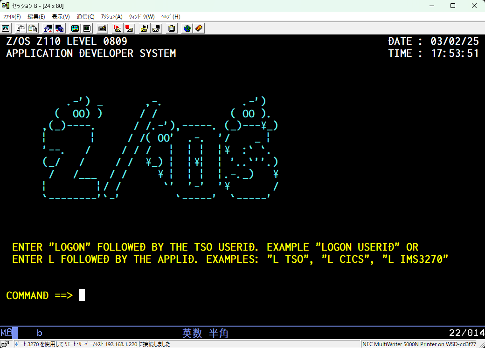

# USSTAB

USSTAB is part of VTAM (Virtual Telecommunications Access Method) and refers to the USS (Unformatted System Services) table. USSTAB is valid only for the logical unit on which it depends.

VTAM (Virtual Telecommunications Access Method) の一部であり、USS (Unformatted System Services) テーブルを指します。USSTABは、VTAMが論理ユニット (LU) から受信する文字コード化された入力を処理するために使用されます。USSTABは、依存する論理ユニットに対してのみ有効です。


 -> O.K.


# Requirement

"hoge"を動かすのに必要なライブラリなどを列挙する

* huga 3.5.2
* hogehuga 1.0.2


# Installation

Requirementで列挙したライブラリなどのインストール方法を説明する

```bash
pip install huga_package
```

# Usage

DEMOの実行方法など、"hoge"の基本的な使い方を説明する

```bash
git clone https://github.com/hoge/~
cd examples
python demo.py
```

# Note

http://patorjk.com/blog/software/

Text ASCII Art Generator – A web app that lets you type in large ASCII Art text lettering. This can create art you can put in your email signature, on your webpage, etc etc.
